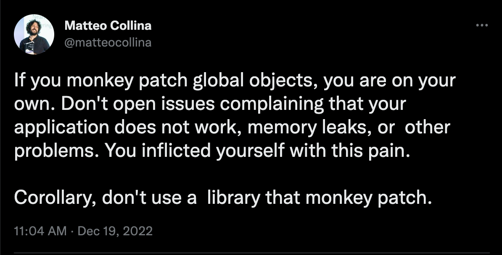
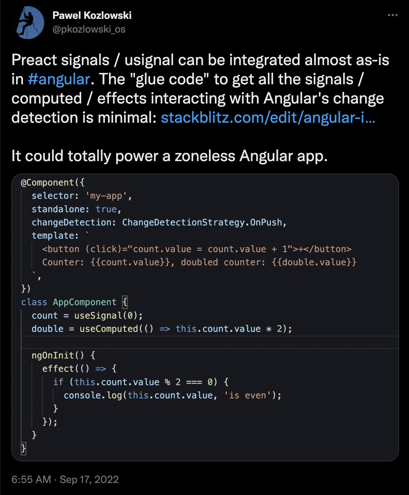

Angular has [announced](https://twitter.com/angular/status/1625939902046117890) a prototype that adds a 'Signal' reactive primitive to the framework. Reactivity with Signals has the potential to fundamentally change how we write Angular applications. This post addresses a few key questions related to this proposal:

1. What is Angular's current Reactivity System?
1. Where did this proposal come from?
1. What is “Reactivity with Signals” and how does it improve Angular’s Reactivity System?
1. What does this mean for RxJS?

## 1. The Current State of Angular's Reactivity: MonkeyPatching with Zone.js

Angular’s reactivity system is due for an upgrade. It is built on `Zone.js`, which is a library that monkey-patches the Browser API (Promise, addEventListener, setTimeout). These monkey-patches allow Angular to hook into browser events, trigger DOM updates, and propagate changes throughout the application using a top-down approach.

I’ll let this tweet by Node.js Technical Steering Committee member Matteo Collina speak for itself:

## 2. This Proposal Was Hinted at During ng-conf 2022

At ng-conf 2022, Angular Engineering Manager Madleina Scheidegger specifically [announced](https://www.youtube.com/watch?v=CABHcf1gCbg):

> We want to change the underlying change detection system for Angular.

Since that presentation, there has been a lot of buzz about adding a [new reactive primitive](https://twitter.com/pkozlowski_os/status/1535726141679579143?t=WyL4L-pkkPRqK2rRvhi9kw&s=19) to Angular. One leading contender for the next generation of reactive primitives is [Signals](https://www.solidjs.com/tutorial/introduction_signals), popularized by Preact and SolidJS. The Angular team took notice, and started putting out [code snippets](https://twitter.com/pkozlowski_os/status/1571105592860889091) ‘glueing’ Signals into Angular last fall.

Obviously the Angular team has continued to explore Signals since last fall, culminating with the prototype they announced yesterday.

## 3. Reactivity With Signals ⇒ Potentially a Zoneless Angular

Signals are objects with a getter, a setter, and a value that changes over time. At first Signals may not sound very interesting. Is this just a new kind of Proxy? Why should I care?

One reason they’ve gained so much popularity is because of how they are used to propagate changes across a web page. Frameworks can hook into a Signals’ setter and getter methods to create a reactivity graph, which allows for [‘fine-grained reactivity’](https://dev.to/ryansolid/a-hands-on-introduction-to-fine-grained-reactivity-3ndf) instead of top-down diffing (read performance gains).

Recently I came across a tweet by Vue founder Evan You that highlights a subtle distinction between reactivity and reactive primitives:

So, when people say a framework uses ‘Signals’, they usually mean that it has (i) a ‘Signal’ Reactive Primitive and (ii) the framework is able to update the DOM with surgical precision when a specific Signal changes value.

Taken one step further, this proposal provides a viable path towards writing fully zoneless Angular applications! 🎉🎉🎉

## 4. Clarifying the Impact of This Proposal on RxJS

For years, Angular developers have argued that the framework should improve integration with RxJS `Observables`. So why is Angular proposal Signals instead of Observables? And do we even need a reactive primitive at all?

If you’re interested in digging into this topic more I highly suggest this article by Mike Pearson: [I changed my mind. Angular needs a reactive primitive](https://dev.to/this-is-angular/i-changed-my-mind-angular-needs-a-reactive-primitive-n2g).

Angular’s proposal pays homage to RxJS, arguing that it could unlock “[s]ignificantly improved interoperability with reactive libraries such as RxJS.”

## Conclusion

The Angular team is still free to pivot away from using Signals. Even if they stick with this prototype, Signals would still have to go through the Request For Comment process and a developer preview.

Whether or not the Angular team settles on Signals as the chosen ‘Rea`ctive Primitive’, it seems like we are finally getting a modern solution to reactivity that is tightly integrated with the framework. Hopefully this translates into improved developer experience and faster applications.

## Bonus: A Timeline Of Signals and Fine-Grained Reactivity

Fine-grained reactivity is a new label on an old idea. A framework utilizing signals effectively makes your application work like a spreadsheet using the Command and Query Responsibility Segregation [(CQRS) pattern](https://learn.microsoft.com/en-us/azure/architecture/patterns/cqrs).

As noted by SolidJS author Ryan Carniato, libraries like MobX and Knockout introduced a similar reactivity model well before modern frameworks integrated the idea.

### Here is a brief timeline of Signals and Fine-Grained Reactivity

2010 Presentation [“What is Reactive Programming”](https://paulstovell.com/reactive-programming/) by Paul Stovell

2014 Eric Meijer — [What Does it mean to be Reactive](https://youtu.be/sTSQlYX5DU0)

- “It’s about the tasteful composition of side effects”

2017 Mobx — [Why MobX runs all derivations synchronously](https://hackernoon.com/the-fundamental-principles-behind-mobx-7a725f71f3e8)

2019 [Svelte Rethinking Reactivity](https://youtu.be/AdNJ3fydeao
)

- [Using RxJS with Svelte](https://timdeschryver.dev/blog/unlocking-reactivity-with-svelte-and-rxjs#conclusion). The compiler and template syntax handle subscriptions for you.

2021 [Solid / Ryan Carmiato](https://dev.to/ryansolid/a-hands-on-introduction-to-fine-grained-reactivity-3ndf)

2022 [Preact Signals](https://twitter.com/_developit/status/1567209440843022341
)

2022 [Qwik Proxies](https://qwik.builder./docs/concepts/reactivity/
)

2022 Madleina Scheidegger

- [ng-conf Presentation](https://www.youtube.com/watch?v=CABHcf1gCbg) at 36:21
- Reactivity: “Stores for state management”
- Reactivity: “Could we have computed properties” (in Angular)

2022–2023 Pawel Kozlowski

- [Exploring Reactive Primitives](https://twitter.com/pkozlowski_os/status/1535726141679579143?t=WyL4L-pkkPRqK2rRvhi9kw&s=19)
- [Glueing Signals into Angular](https://twitter.com/pkozlowski_os/status/1571105592860889091)
