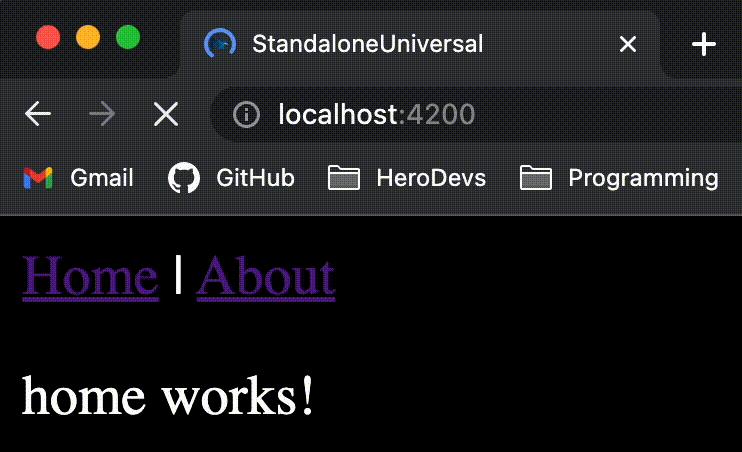

[Angular 16](https://github.com/angular/angular/blob/main/CHANGELOG.md#1600-rc0-2023-04-12)’s release candidate introduces a [long-awaited feature](https://github.com/angular/angular/issues/13446) that will revolutionize the Angular SSR experience: **non-destructive hydration**.

This feature has the potential to [improve Core Web Vitals scores](https://twitter.com/mgechev/status/1643324830761259008?t=estNUMQ1tPCF9UYQEVF7aQ&s=19), [increase SEO performance](https://blog.angular-university.io/angular-universal/), and even get rid of the dreaded ‘flicker’ from Angular Universal applications. The Angular team recently confirmed that improving Server Side Rendering is a [top priority in 2023](https://blog.angular.io/whats-next-for-server-side-rendering-in-angular-2a6f27662b67) and that non-destructive hydration is a stepping stone towards their vision for the future.

This post covers three aspects of non-destructive hydration: (1) an example of the old Angular Universal ‘flicker’, (2) a quick introduction on how to use non-destructive hydration, and (3) a glossary with explanations of a few keys terms.

## 1. The Flicker

If you’ve ever used an Angular Universal application you may have come across the ‘flicker’:



This flicker occurs because Angular Universal uses destructive hydration by default. When an Angular application is Server Side Rendered, a static HTML file is immediately sent to the client on page load. This provides a faster First Contentful Paint than traditional SPAs because template is displayed before application code is downloaded.

With destructive hydration, as soon as the client code is bootstrapped it blows away the server-rendered DOM and replaces it with client-rendered DOM. That’s what causes the flicker. Angular Universal co-creator Jeff Whelpley gives an [entertaining example of destructive hydration](https://www.youtube.com/watch?v=19bN92JLRIg&t=540s) in this talk at NG-BE 2023.

Non-destructive hydration, on the other hand, allows Angular to re-use server-side rendered DOM. Which means no flicker!

Removing the flicker is more than a UX bugfix, it represents a fundamental improvement in Angular’s SSR. It means that Angular is able to avoid extra work to re-create DOM nodes so users get a faster Largest Contentful Paint.

## 2. Usage

Create a new Angular application and add Angular Universal:

```sh
# Generate a new Angular app
npx @angular/cli@next new standalone-universal --standalone

# Add support for Angular Universal
npx ng add @nguniversal/express-engine@next
```

Then, add provideClientHydration() to the app.config.ts file.

```typescript
import { ApplicationConfig } from '@angular/core';
import { provideClientHydration } from '@angular/platform-browser';
import { provideRouter } from '@angular/router';
import { routes } from './app.routes';

export const appConfig: ApplicationConfig = {
  providers: [providerRouter(routes), provideClientHydration()]
};
```

If you’re interested in an in-depth guide on setting up an application with non-destructive hydration, check out this [video](https://www.youtube.com/watch?v=25FgSUH4DCk) by [Brandon Roberts](https://twitter.com/brandontroberts).

## 3. Glossary

Below is a glossary of key terms related to non-destructive hydration:

### Server Side Rendering

> By default, Angular renders applications only in a browser. Angular Universal allows Angular to render an application on the server, generating static HTML contents, which represents an application state. Once the HTML contents is rendered in a browser, Angular bootstraps an application and reuses the information available in the server-generated HTML.

[https://next.angular.io/guide/universal](https://next.angular.io/guide/universal)

### Hydration

Hydration is the process that restores the server side rendered application on the client. This includes things like reusing the server rendered DOM structures, persisting the application state, transferring application data that was retrieved already by the server, and other processes.

[https://next.angular.io/guide/hydration#what-is-hydration
](https://next.angular.io/guide/hydration#what-is-hydration
)

### Non-Destructive Hydration

This technique will allow us to reuse the server-side rendered DOM and rather than rerendering it only attach event listeners and create data structures required by the Angular runtime.

[https://next.angular.io/guide/roadmap#in-progress
](https://next.angular.io/guide/roadmap#in-progress
)

***

Disclaimer: Angular [16.0.0-rc.0](<https://www.npmjs.com/package/@angular/core/v/16.0.0-rc.0>) was the latest v16 release candidate at the time of writing this article. Release candidates of Angular should not be run in any production application or environment.
