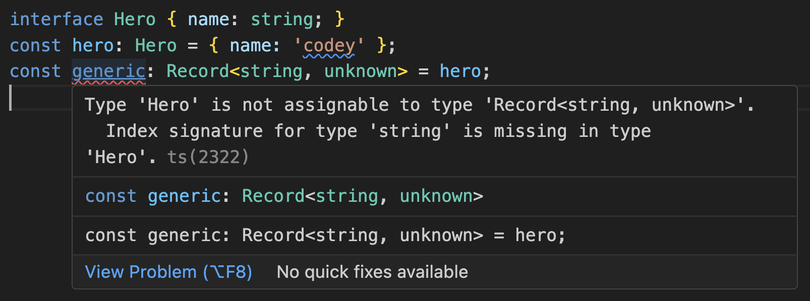
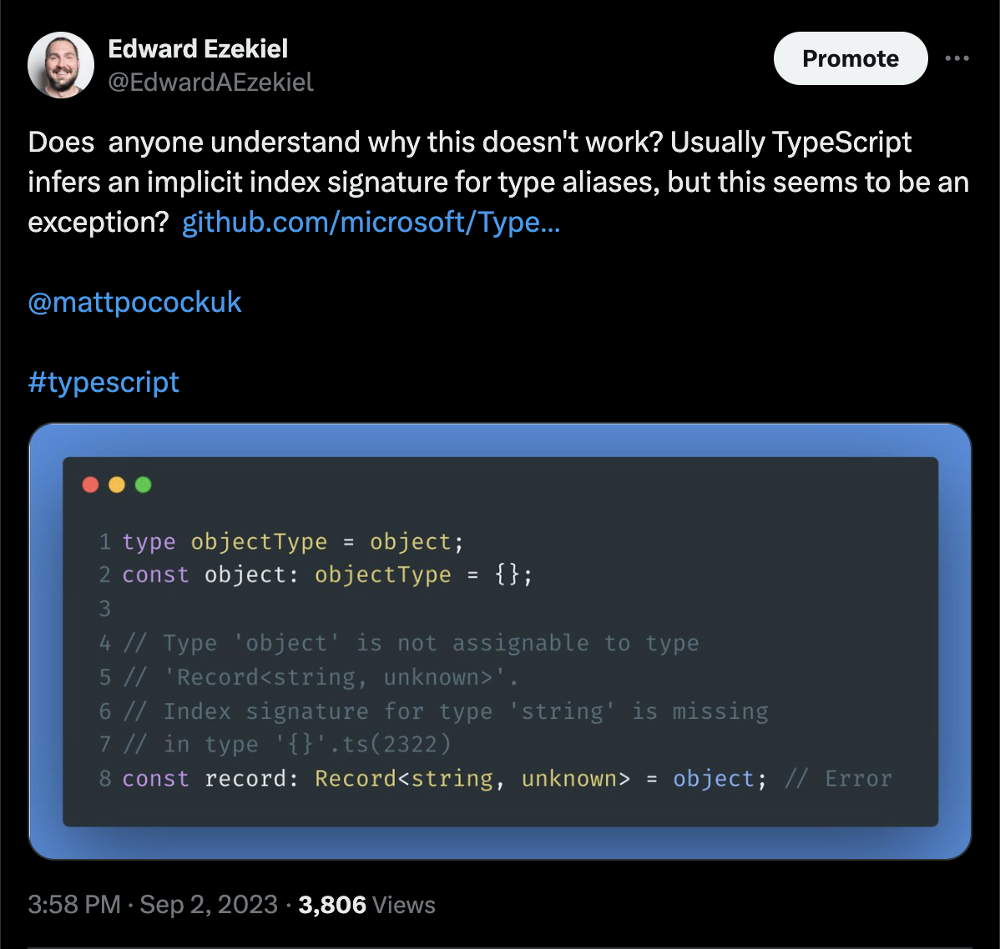
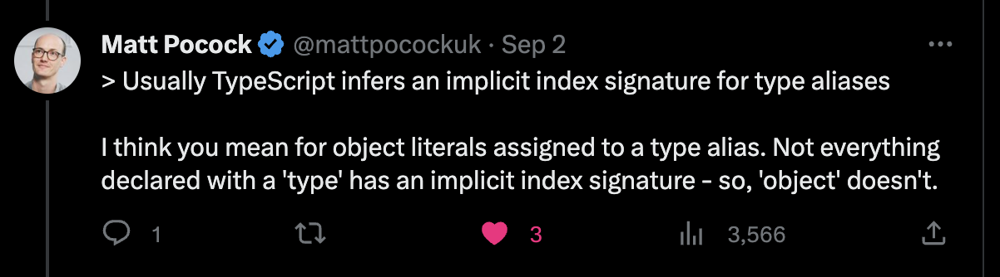

Index signatures are one of TypeScript’s heroes. They enable features like Mapped Types, utilities like Record and Pick, and generic types like Dictionaries.

But like any good hero, index signatures have some quirks. If you’ve [seen this error](https://stackoverflow.com/questions/65799316/why-cant-an-interface-be-assigned-to-recordstring-unknown) before you know what I mean:



This post embraces those quirks and explains how to leverage them when dealing with index signatures.

**tldr;**

- Prefer using types over interfaces to avoid some index signature quirks.
- When interfaces are necessary, combine the spread operator `{ …object }` and `Record<string, unknown>` for a balance of flexibility and type safety.
- Remember that index signatures are only implicit in object literal types (not `string`, `number`, or even `object`).
- If all else fails, use an index signature with the base constraint of `any`.

## A Primer on Index Signatures

Index signatures are helpful when “you don’t know all the names of a type’s properties ahead of time, but you do know the shape of the values.” See [TypeScript Docs](https://www.typescriptlang.org/docs/handbook/2/objects.html).

Earlier in this post, I defined a Hero interface but got an error `Index signature for type 'string' is missing`. Well, that error is easily 'fixed’ by adding a string index signature to the Herointerface.

```typescript
interface Hero { 
  name: string,
  [key: string]: string // Manually add index signature
}
const hero: Hero = { name: 'codey' }
const generic: Record<string, unknown> = hero;
```

This solution has trade-offs though, because now the`Hero` interface is a dictionary of arbitrary strings. At the end of this article we’ll discuss alternatives that are more type-safe.

In the next section we’ll analyze how TypeScript lets you *implicitly* add an index signature for type aliases.

## Quirk #1: Index Signatures Are Implicit in Type Aliases

Let’s see what happens when we convert the interface to a type and remove the index signature:

```typescript
type Hero = { 
  name: string,
  // [key: string]: string 
}
const hero: Hero = { name: 'codey' } // Implicit index signature
const generic: Record<string, unknown> = hero;
```

It still works! How is TypeScript able to confirm that `hero` satisfies the `Hero` index signature? Well, TypeScript infers an implicit index signature for object literal types assigned to a type alias. [TypeScript v2.0 Release Notes](https://www.typescriptlang.org/docs/handbook/release-notes/typescript-2-0.html#implicit-index-signatures) This difference in behavior between types and interfaces is an intentional feature of TypeScript. [TypeScript Issue #15300](https://github.com/microsoft/TypeScript/issues/15300#issuecomment-1320620897).

Implicit index signatures is one of the reasons why Matt Pocock [generally prefers types over interfaces](https://www.totaltypescript.com/type-vs-interface-which-should-you-use).

We’re not out of the woods yet though. There are still some caveats and true head-scratchers left to consider.

## Quirk #2: Index Signatures are Implicit in Type Aliases (Except When They Aren’t)

Like any good rule, implicit index signatures for type aliases has exceptions. For example:



I was surprised to see the `Index signature for type 'string' is missing` error occurred even when I assigned an object literal an `object` type. Well, thanks to Matt Pocock I got some quick clarification:



Thanks Matt! The TypeScript v2.0 release notes confirm Matt’s distinction:

> An object literal type is now assignable to a type with an index signature if all known properties in the object literal are assignable to that index signature.

Index signatures are implicit for object literal types (not the object type):

```typescript
const hero = { name: 'codey' } // object literal
const generic: Record<string, unknown> = hero;
```

We’ve come a long way and decoded several quirks invoking index signatures. But there’s still one final wrinkle to consider coming up in the next section.

### Quirk #3: Why Does Record<string, any> Work With Interfaces?

The final quirk is that, somehow, you can assign an interface to a Record in this scenario:

```typescript
interface Hero { name: string; } // Missing the 'string' index signature
const hero: Hero = { hero: 'codey' };
const generic: Record<string, any> = hero; // No Error. Why? How?
```

So what’s going on here?

Is there a hard-coded check in the TypeScript compiler specifically for `Record<string, any>` that allows interfaces to be assigned to that type? No. As [noted by Ryan Cavanaugh](https://github.com/microsoft/TypeScript/issues/42825#issuecomment-780873604), TypeScript Development Lead, this behavior is broader than just the Record type:

![Ryan Cavanaugh comment about assignability to { [s: string]: any }](../images/2023-09-04-Ryan-Cavanaugh.png)

Indeed, we can confirm that the Record utility has nothing to do with this quirk:

```typescript
interface Hero { name: string; } // Still no string index signature
const hero: Hero = { name: 'codey' };
const generic: { [key: string]: any } = hero; // Somehow still works with Record
```

At this point you might suspect that the `any` in `Record<string, any>` is the root of this behavior. And you’d be right. As [explained by TypeScript lead architect Anders Hejlsberg](https://github.com/microsoft/TypeScript/issues/27470#issuecomment-426073500):

> We currently have the following rule:
>
> A type S is related to a type T[K] if S is related to C, where C is the base constraint of T[K].
>
> … we now drill all the way down and find the any constraint for T[K] in your example above. And since anything is assignable to any we effectively turn off type checking.

This doesn’t mean that TypeScript entirely ignores index signatures when the constraint is any. You still get an error if you try to assign an interface with string keys to an index signature expecting number keys:

```typescript
interface Hero { name: string; }
const hero: Hero = { name: 'codey' };
const generic: { [key: number]: any } = hero; // Error
```

## Epilogue: Leveraging Implicit Index Types to Satisfy Record<string, unknown>

Now it’s time to put our mental model to work. Let’s examine `Record<string, any>` and consider other options for handling index signature errors in TypeScript.

### The Setup: A Generic Method to Convert Objects to JSON

Imagine you’re importing an interface from a third-party library, and you’re trying to pass that interface to a generic json parsing utility function:

```typescript
import { Hero } from 'third-party-library'

const hero: Hero = { name: 'codey' };

function parseObject<T>(obj: Record<string, unknown>) {
  return JSON.stringify(obj);
}

parseObject(hero); // Error
```

However, you get the error `Index signature for type 'string' is missing in type { YourType }` because the third-party interface doesn’t have a string index signature. Coming up next, we’ll discuss three solutions to this issue and pick one.

### Solution 1: Change your Parameter to Record<string, any>

A common solution to this scenario is simply to change your parameter’s type to `Record<string, any>`. But then you notice that type safety is out the door:

```typescript
function parseObject(obj: Record<string, any>) {
  let doesNotExist = obj['doesNotExist']; // ok maybe it's not so bad
  doesNotExist.toString(); // yikes
  doesNotExist += 100; // double yikes
}
```

If you’re careful, you can avoid accessing non-existent properties while you write the function. But what about the developer that comes after you? Maybe there’s a more robust solution.

### Solution 2: Tack on an Index Signature to Your Interface

By now you understand that the root of your error is that interfaces don’t have a string index signatures. Well, why don’t we just tack on an IndexSignature to any interface passed to our function?

```typescript
type IndexSignature<T extends {}> = {
  [K in keyof T]: T[K];
};
interface Hero { name: string; }
const hero: Hero = { name: 'codey' };

function addIndexSignature<T extends {}>(obj: T): IndexSignature<T> {
  return obj;
}

parseObject(addIndexSignature(hero));
```

This approach does seem to ‘fix’ the error. But you have a sneaky suspicion that the IndexSignature type is too broad. You double check to make sure that functions are *not* allowed:

```typescript
parseObject(
  addIndexSignature(() => { console.log('whoops'); }) // This should be an Error
);
```

This edge case probably won’t come up very often. But surely there’s a more robust solution?

### 🎉Solution 3: Use The Spread Operator to Satisfy Record<string, unknown> 🎉

Taking everything you’ve learned so far, you leverage the spread operator to create an object literal, gaining an implicit index signature and satisfying the Record<string, unknown> base constraint:

```typescript
function parseObject(obj: Record<string, unknown>) {
  let doesNotExist = obj['doesNotExist'];
  doesNotExist.toString(); // Error: 'doesNotExist' is of type 'unknown'.ts(18046)
  doesNotExist += 100; // Error: 'doesNotExist' is of type 'unknown'.ts(18046)
}

parseObject({ ...hero }); // Works
```

Congratulations! You’ve reached a solution that offers a balance of flexibility and type safety. This solution is referenced in the [GitHub Issues #15300 Index signature is missing in type (only interfaces, not aliases)](https://github.com/microsoft/TypeScript/issues/15300#issuecomment-436793742), but without much explanation. This solution is not a silver bullet, but if using the spread operator is acceptable in your scenario then it’s a solid choice.

I hope this article gives you a robust foundation to understand this problem, the potential solutions, and a greater appreciation for one of TypeScript’s heroes!
