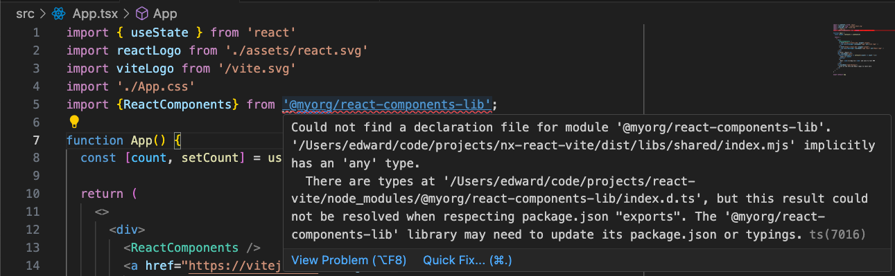

Nx provides a mental model for organizing monorepos and creating publishable libraries. Regardless of the frontend
framework being used, it's easy to locate projects within `apps` and `libs` folders, and quickly identify `targets` for
building, serving, and testing libraries.

One of my personal hobby projects, [ngx-unit-test](https://github.com/edezekiel/ngx-unit-test) is a Nx monorepo containing
one Angular application and one [publishable library](https://www.npmjs.com/package/@ngx-unit-test/inject-mocks). Setting up
this publishable library was a breeze using Nx.

I recently explored doing something similar with React. The rest of this article steps through the process of generating
this library, some pitfalls with existing Nx generators, and some solutions.

## The Setup: Creating a Publishable Library and One Consumer Application

My goal for this project was to create a publishable React library ("react-components-lib") and one standalone application that
installs the library ("standalone-react-app"). Of course, you can simply import shared libs into apps in the same
monorepo. But for this project I specifically wanted to test out the "publishable" workflow.

For local development of the library, I want to be able to test changes to the library without actually publishing a
version to npm. The `npm link` cli command allows you accomplish exactly that: "linking" publishable libraries locally
on a machine to test changes as-if you were installing the package from npm.

### Generating the Library and Application

The Nx and Vite CLIs take care of most of the setup:

- Run `npx create-nx-workspace@latest nx-react-vite` in the terminal

- Step through the interactive CLI (I chose 'React', 'None', 'Integrated Monorepo', 'Vite', 'Playwright", and 'emotion')

- Use Nx generators to generate the publishable "react-components-lib"

- Use `npm create vite@latest` to generate a standalone React application ("standalone-react-app")

This is roughly what I wound up with:

```txt
// Versions of core packages
"nx": "18.3.4",
"vite": "~5.0.0",
"react": "18.2.0",

// Monorepo containing the publishable React Library ("react-components-lib")
nx-react-vite
  /libs
    /react-components-lib

// Separate repository of the consumer React app
standalone-react-app
  /src
  ...
```

### NPM Link Issue

Once everything was generated, I wanted to test publishing react-components-lib using npm link:

1. First, I used Nx to create the production dist of the library: `npx nx run react-components-lib:build`. This command created a build dist at
`nx-react-vite/dist/libs/shared`.

1. Next, I ran `cd dist/libs/shared` and then `npm link`. So far so good.

1. Finally, I tried to add the package to the standalone-react-app by `cd`ing into the app and running `npm link @myorg/react-components-lib`. Here is where I hit
my first roadblock:

> npm ERR! 404 Not Found - GET `https://registry.npmjs.org/@myorg%2freact-components-lib` - Not found.

I realized that the library's production build didn't include a package.json. So when I ran `npm link` from the consumer
application, it failed to create a global symlink for the package's name. The Angular Nx generators for a publishable
lib handle this step automatically. This appears to be a [known issue](https://github.com/nrwl/nx/issues/21758) involving Nx 18.

My solution was to run `npm i -D rollup-plugin-copy` and update the `vite.config.ts` file to copy the `package.json`
into the dist folder after the build is complete. Here is an [example commit](https://github.com/edezekiel/nx-react-vite/commit/28d3115a64e4857c65356f1c76a8998adfc0bdc6) showing these steps.

With these changes in place, I repeated steps 1-3 (above), and this time the standalone-react-app successfully linked
to the react-components-lib package! 🎉🎉🎉

### Issue with Missing Declaration Module

My next step was to actually use a component from react-components-lib in the standalone-react-app. I imported a
component from the library, but was met with an error about the package's missing declaration module:



This error was pretty straightforward. All I had to do was add a line to the library's package.json in the
"exports" field: `"types": "./index.d.ts",`. Again, this is something that is handled automatically by Nx when creating
a publishable Angular library but hasn't been implemented for this template.

With this small tweak, I fixed the error and was able to successfully build and serve standalone-react-app.

## Conclusion

This project taught me a few concepts involving npm linking, package.json configuration, and Vite configuration. Although
there were some rough edges to creating a publishable React library, Nx and Vite massively sped up my development
cycle and provided a good foundation for the project.
